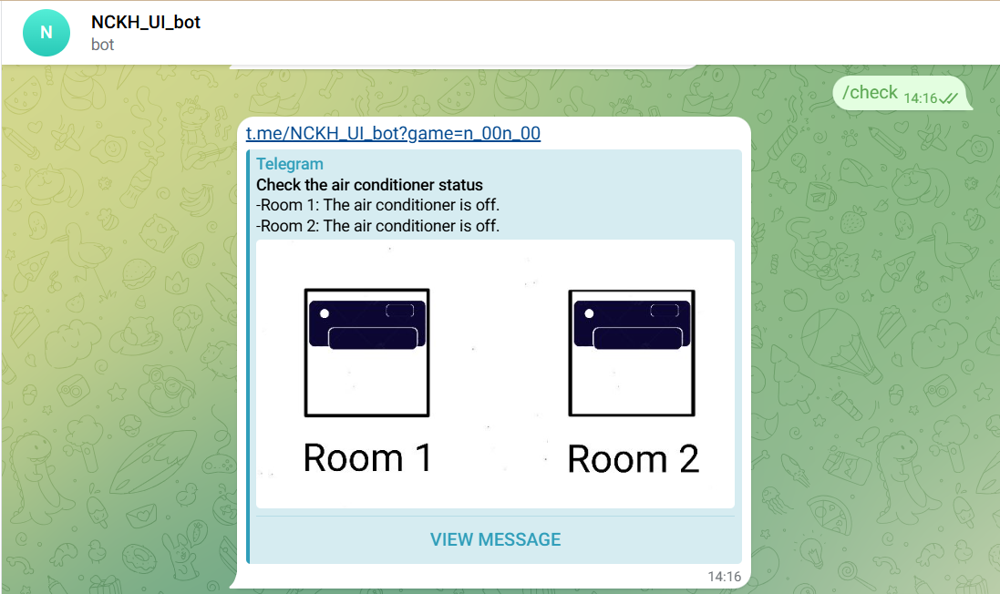
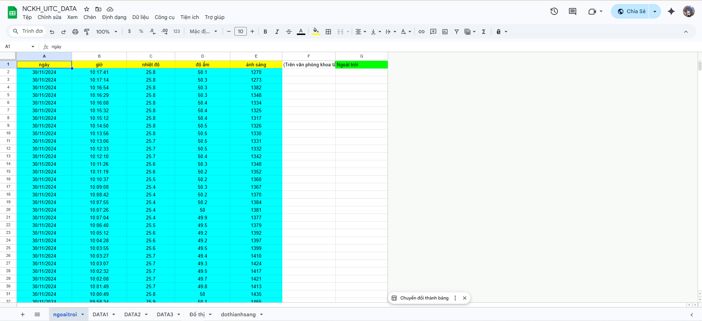

# Project 1 - 2024
"Nghiên cứu, thiết kế giao diện người dùng dựa trên Telegram Chatbot" - Đề tài NCKH cấp học viện loại A

**Mục tiêu chính:**

- Nghiên cứu sử dụng Telegram ứng dụng cho giao diện người dùng

- Lưu trữ, giao tiếp giữa các thiết bị không dây

- Thực thi các tác vụ song song giữa trên đám mây và thiết bị

## Kết quả đạt được

_Sau khi hoàn thiện và báo cáo trước Hội đồng, đã đạt được các mục tiêu trên cụ thể như sau_

### 1. Ứng dụng Telegram cho giao diện người dùng

**Việc sử dụng Chatbot của Telegram cho phép đưa ra thông báo một cách nhanh chóng và bảo mật cao. 
Tuy nhiên, vì background giao diện của Telegram phụ thuộc vào người dùng thiết lập trên app, 
do vậy nên việc thiết kế giao diện người dùng dựa trên Chatbot sẽ trở thành thiết kế cho các khung chat để Bot có thể hiển thị lên cho người dùng với kết quả như dưới đây.**

- Khi Bot thấy người dùng chat một điều gì đó bất kỳ mà không trong tập lệnh, sẽ đưa ra khung chat hướng dẫn sau:

- Khi Bot nhận được các lệnh từ người dùng ứng với tập lệnh, sau khi xử lý và đưa ra kết quả sau khi đi qua thuật toán phát hiện, sẽ hiển thị kết quả giao diện như sau:

-> Trong khuôn khổ phạm vi của kiến thức đạt được lúc đó, đề tài chỉ dừng ở mức sử dụng giao diện 
để hỗ trợ người dùng phát hiện ra trạng thái đèn và điều hòa trong phòng dựa trên thuật toán được tổng hợp từ dữ liệu đã thu và được chạy, lưu trữ trên đám mây.

### 2. Lưu trữ, giao tiếp giữa các thiết bị không dây

- Đề tài sử dụng một đám mây nhằm làm trung gian giao tiếp giữa các ESP32. Cụ thể là tận dụng AppScript của GoogleSheet nhằm thực hiện điều này.

Dưới đây là link GoogleSheet liên quan được sử dụng để lưu trữ dữ liệu: [Link](https://docs.google.com/spreadsheets/d/1FPFGATJwMvb11FkONY54MGBXiD6Byf6wq9OArbI1dzY/edit?gid=1407162229#gid=1407162229)

_Lưu ý: Do GoogleSheet giới hạn ở 255 triệu ô, nên cần xóa đi các cột không cần thiết để tránh bị giới hạn làm mất dữ liệu thu được_

### 3. Thực thi các tác vụ song song giữa đám mây và thiết bị

- Tận dụng việc giao tiếp giữa các Sheet trên GoogleSheet, có thể sử dụng bộ đôi AppScript và GoogleSheet để tạo ra một Sheet riêng chuyên xử lý dữ liệu mới nhất từ các node cảm biến

Sheet chứa bảng và thuật toán: [Link](https://docs.google.com/spreadsheets/d/150dekcJ24wxHlKx5Yk9q0WGgxaNNynC73zr6MBeT-2Q/edit?gid=0#gid=0)

-> Thuật toán là việc tổng hợp và theo dõi dữ liệu từ tất cả các ngày thu được xuyên suốt từ tháng 7 đến tháng 11 năm 2024. 
Từ đó, tổng hợp các điểm đặc biệt khi bật/tắt điều hòa và đèn trong phòng để tạo nên một thuật toán đơn giản giúp theo dõi được trạng thái của 2 thiết bị này với độ chính xác tốt.

- Do sử dụng bộ đôi AppScript và GoogleSheet này để xử lý thuật toán và lưu trữ dữ liệu nên các node cảm biến sẽ độc lập và không quá phụ thuộc vào nhau. Dẫn tới việc các node có thể tự kiểm tra trạng thái hoạt động của lẫn nhau thông qua thời gian phản hồi trên Sheet để thông báo lập tức cho người dùng ngay khi có node mất kết nối

### 4. Vấn đề cần cải thiện

- Nhược điểm của của việc sử dụng bộ đôi này là tính tự động hóa, khi người dùng sẽ phải tự kiểm tra và chỉnh sửa thuật toán thủ công. 
Nên nếu sử dụng bộ đôi này để xử lý thuật toán chỉ phù hợp cho việc nghiên cứu, cụ thể sẽ ứng dụng tốt nhất trong việc lưu trữ dữ liệu lên cloud.

- Nhược điểm tiếp theo là phụ thuộc vào WiFi và số lượng dữ liệu đã lưu, nếu lưu quá nhiều dữ liệu vào một sheet sẽ dẫn tới việc bị tăng độ trễ lên.